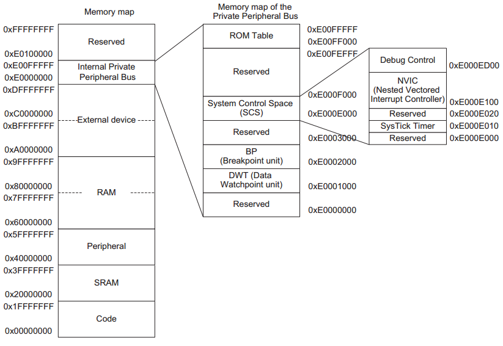
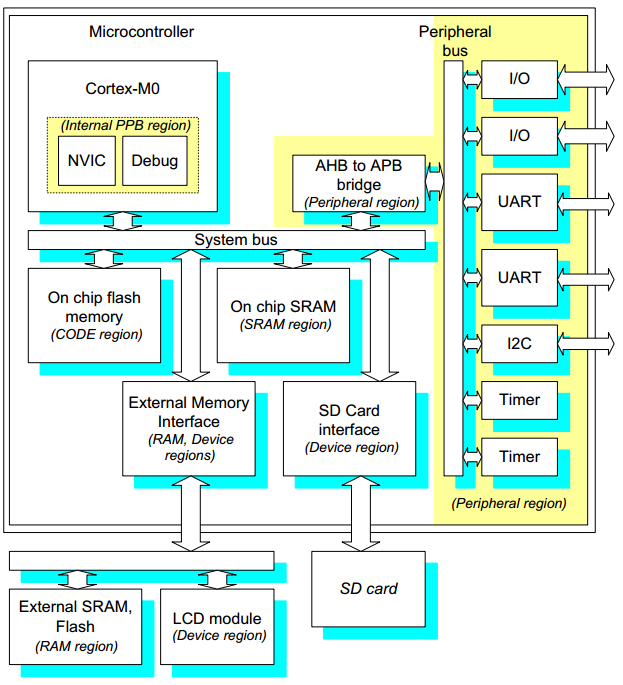
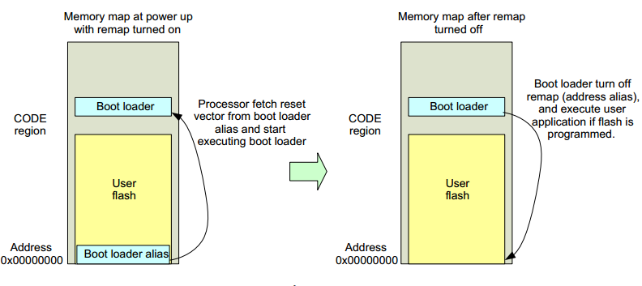
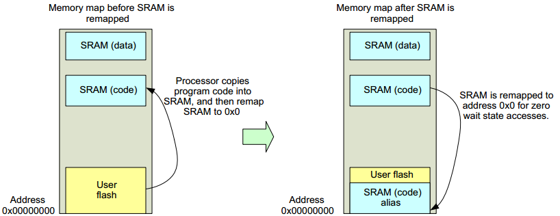

# 存储系统

Cortex-M0 处理器具有两个总线接口，32位系统总线和32位地址总线，所以可以访问4GB的地址空间。4GB存储空间被划分为以下几个区域：

### 1. 代码区域 Code

代码区域为512MB字节，主要用于存储程序代码，其中也包括映射的一部分中断向量表。

### 2. SRAM 区域

存储器映射的第二块512MB，主要用于数据存储，包括栈和堆。在要求高速运行代码的情况下，可以将Code区或外部存储器代码代码复制到SRAM里并执行，调高运行效率。

### 3. 外设区域

512MB，主要用于外设以及数据存储。这段区域不可以执行代码。

### 4. RAM 区域

RAM两块区域，总共1GB，用于数据存储，可执行代码。两个区域拥有不同的属性.

### 5. 设备区域

两个512MB，其中各Soc开发商可以在这段区域定制外设寄存器，如UART，IO，SPI等。也可用于数据存储，但不可执行代码。

### 6. 内部私有外设总线 PPB

1M空间，不可执行代码，用于处理器内部的外设，包括系统控制空间SCS，中断控制器NVIC，调试部件等。
0xE000E000~0xE000EFFF段为系统控制空间SCS，其包括中断控制寄存器，系统控制寄存器和调试控制寄存器等。SCS中还包含一个可选定时器SysTick。

### 7. 保留存储器空间

511MB，预留给供应商。

典型的Cortex-M0系统存储器映射：

1. Flash 存储器，用于程序代码
2. 内部SRAM
3. 内部外设
4. 外部存储器接口，用于外部存储器和外部外设
5. 其他外部外设接口

## 数据存储

程序代码一般放在片上flash存储器，也就可以放在外部存储器。对应Cortex-M0来说，系统复位启动后，首先访问0地址的向量表，取得栈MSP的初始值和复位向量，然后从复位向量开始执行程序（关于启动流程和Boot loader请参考[启动和Boot]()）。

用户可以编写程序在flash中，代码从flash执行。但是芯片在出厂时没有代码就无法运行，所有一般芯片厂商 都会在flash中单独划分区域来设置一个Boot loader，这样系统在复位后首先执行的是Boot loader，其主要作用是初始化基本运行环境，引导用户程序。当系统存在多个启动入口时，Boot loader是通过重映射实现的，这样Boot loader在上电时会根据不同条件重映射到不同程序入口，这样就形成了多种存储器启动。存储器映射的切换由硬件寄存器控制，Boot loader会设置这些寄存器。

也可以将程序重映射到SRAM中，这样提高了执行速度。例如，微控制器在高时钟频率下执行，但是flash的执行速度较低时，程序在执行时就需要插入等待状态。但在SRAM中执行就无需等待。

